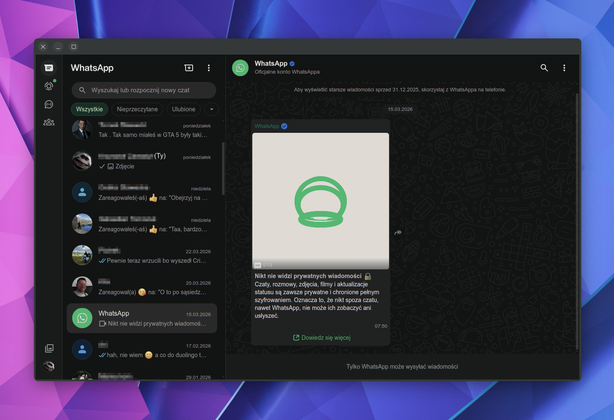

# KWazzup

An unofficial WhatsApp Web client for KDE Plasma, built with Qt 6 and KDE Frameworks 6.

[](https://github.com/thanek/kwazzup/releases/latest)

**Download:** [.deb](https://github.com/thanek/kwazzup/releases/latest) · [.rpm](https://github.com/thanek/kwazzup/releases/latest) · [.tar.gz](https://github.com/thanek/kwazzup/releases/latest)



> **Disclaimer:** KWazzup is not affiliated with, endorsed by, or connected to WhatsApp LLC or Meta Platforms, Inc. WhatsApp is a trademark of WhatsApp LLC. This project simply wraps the publicly available WhatsApp Web interface.

## Features

- Native KDE notifications with sound (KNotification / `kwazzup.notifyrc`)
- Plasma system tray icon with unread message badge (KStatusNotifierItem)
- Global keyboard shortcut to show/hide the window (default: **Meta+W**)
- Automatic light/dark theme following the system colour scheme
- Spell checking powered by KDE Sonnet
- Single-instance enforcement via D-Bus (KDBusService) — clicking the launcher icon brings the existing window to front
- Persistent login session across restarts
- Download manager with native save dialog
- Do Not Disturb mode
- Zoom controls (Ctrl+Plus / Ctrl+Minus / Ctrl+0)
- Custom User-Agent override
- Autostart at login

## Requirements

| Dependency | Version |
|---|---|
| Qt | 6.5+ |
| KDE Frameworks | 6.0+ |
| CMake | 3.20+ |
| ECM (Extra CMake Modules) | 6.0+ |

Required KF6 components: `CoreAddons`, `Crash`, `DBusAddons`, `I18n`, `WidgetsAddons`, `IconThemes`, `Notifications`, `ConfigWidgets`, `Config`, `GlobalAccel`, `StatusNotifierItem`, `WindowSystem`, `XmlGui`, `TextWidgets`

## Building

```bash
cmake -B build -DCMAKE_BUILD_TYPE=Release
cmake --build build
```
or
```bash
make
```

### Installing

```bash
sudo cmake --install build
```
or
```bash
make install
```

Or install to a custom prefix:

```bash
cmake -B build -DCMAKE_INSTALL_PREFIX=~/.local
cmake --build build
cmake --install build
```

### Running without installing

```bash
./build/bin/kwazzup
```

### Packaging (Debian/Ubuntu)

```bash
cmake -B build -DCMAKE_BUILD_TYPE=Release -DCMAKE_INSTALL_PREFIX=/usr
cmake --build build
DESTDIR=pkg cmake --install build
```

## Distro packages

*None yet — contributions welcome!*

## Contributing

Contributions are welcome. Please read [CONTRIBUTING.md](CONTRIBUTING.md) before submitting a pull request.

## License

KWazzup is free software licensed under the **GNU General Public License v3.0 or later**. See [LICENSE](LICENSE) for details.

## AI notice

This project was developed with the assistance of AI.
